# PyViz-homework
Homework on PyViz due on 2/5/2020

_*Figures produced on San Francisco Housing Market Analysis for years 2010 to 2016 are show below:*_
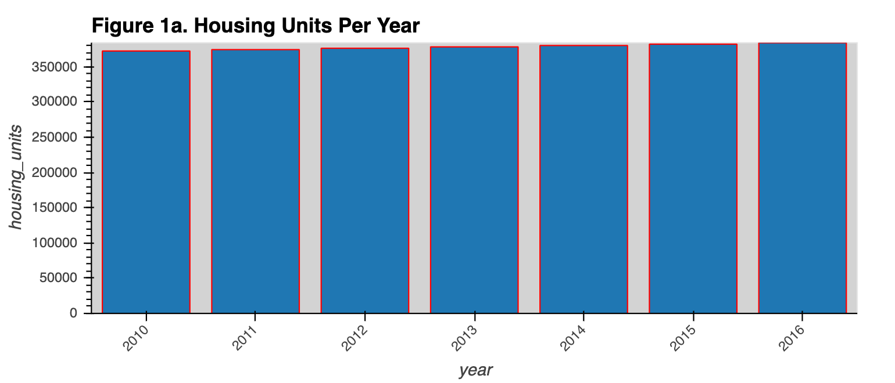
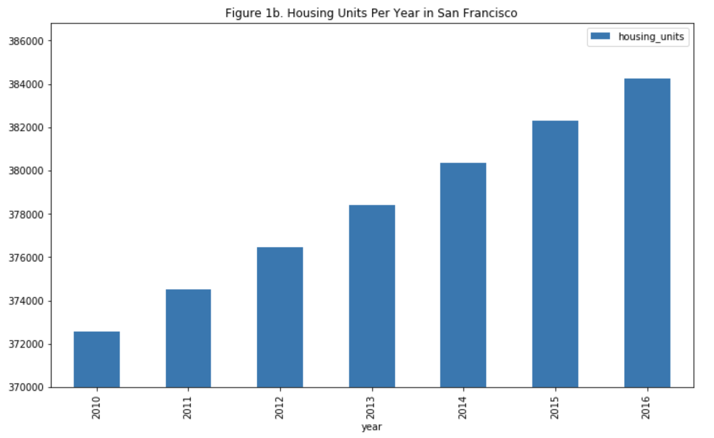
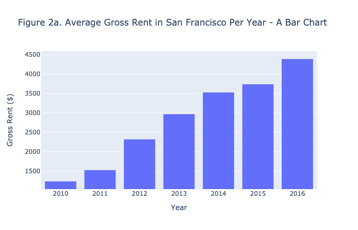
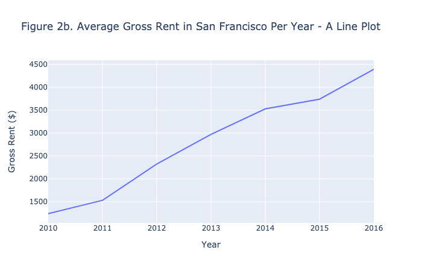
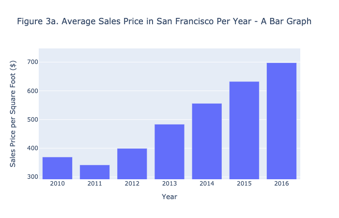
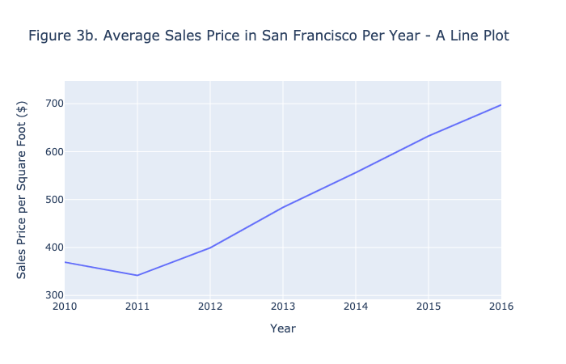
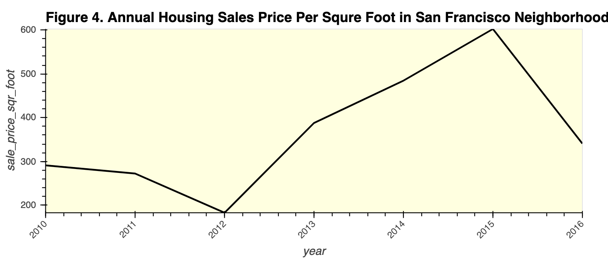
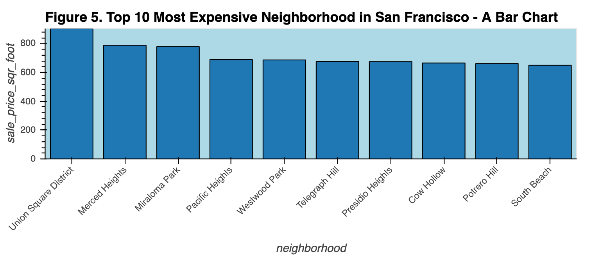
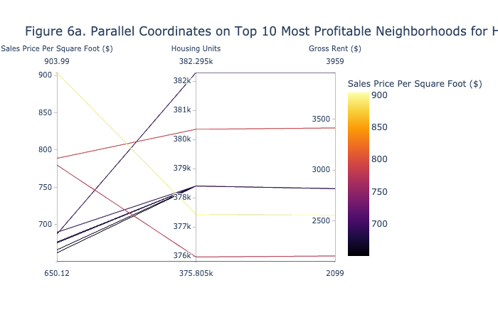
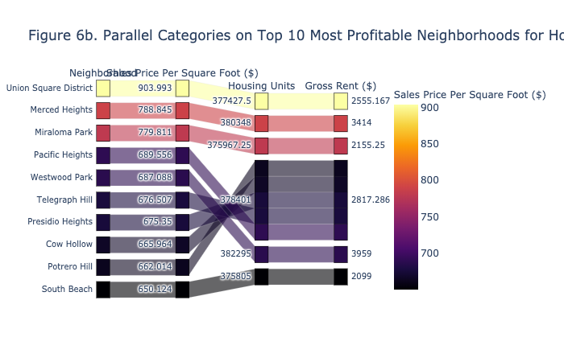
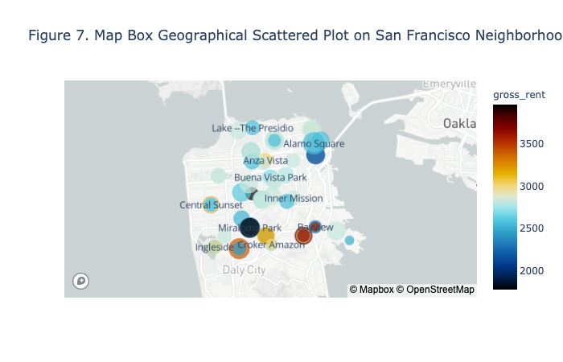

# Panel Design

_After running the "panel serve dashboard.ipynb" as a command,_
_Figures created from hvplot are displayed in the panel_
_However, the panel does not display corresponding figures from plotly express._

_*The design is as follows*_
               Supply              |       Annual_Bar       |     Annual_Line            |                Neighborhood          |       Analysis              
---------------------------------- | -----------------------|----------------------------| ------------------------------------ | ------------------------
How Many Housing Units Are There?     |  Think Or Swim         | See Trends in San Francisco|                 Nailed It!           |  Home. Sweet Home!       
Fluctuations Over Year                   |    Is It A Good Deal?  |      Enjoy or Lease?       |     Most Luxurious Neighborhoods     |   Where are we heading 
   Figure 1a                                |     Figure 2a          |         Figure 3a          |           Figure 4                  | Figure 6a and 6b    
         Figure 1b                            |  Figure 2b             |       Figure 3b            |            Figure 5                  |  Figure  7       

_*Clicking on the tabs, one is directed to visual representation for one of the four categories below:*_
* Housing Units Supply of San Francisco from 2010 to 2016
* Yearly Gross Rent vs Sales Price per Square Foot 
    * Bar Charts and Line Plots
* Sales Price per Square Foot based on Neighborhoods in San Francisco
    * Interactive unit price for neighborhoods
    * Top 10 most expensive neighborhoods represented using in a bar chart
* Analysis of the interactions between the supply, gross rent, unit sales price, based on geographical locations
    * Parallel Coordinates Plot, color coded for unit sales price
    * Parallel Categories Plots, color coded for unit sales price
    * Map Box Scatter Plot based on neighborhoods, sized to represent unit sales price, color-coded on gross rent.

# References:
* CU GitLab Repository
* https://github.com/willwillis/python-pyviz-homework/blob/master/dashboard.ipynb
* https://github.com/willwillis/python-pyviz-homework/blob/master/rental_analysis.ipynb
* https://plot.ly/python/line-charts/
* https://panel.holoviz.org/gallery/index.html
* https://plot.ly/python/plotly-express/
* https://www.youtube.com/watch?v=DAQNHzOcO5A
* https://stackoverflow.com/questions/59118664/lineplot-with-markers-in-holoviews-or-hvplot
* http://holoviews.org/user_guide/Plotting_with_Bokeh.html
* http://holoviews.org/user_guide/Customizing_Plots.html
* http://holoviews.org/user_guide/Styling_Plots.html
* http://holoviews.org/user_guide/Plotting_with_Bokeh.html
* https://guides.github.com/features/mastering-markdown/