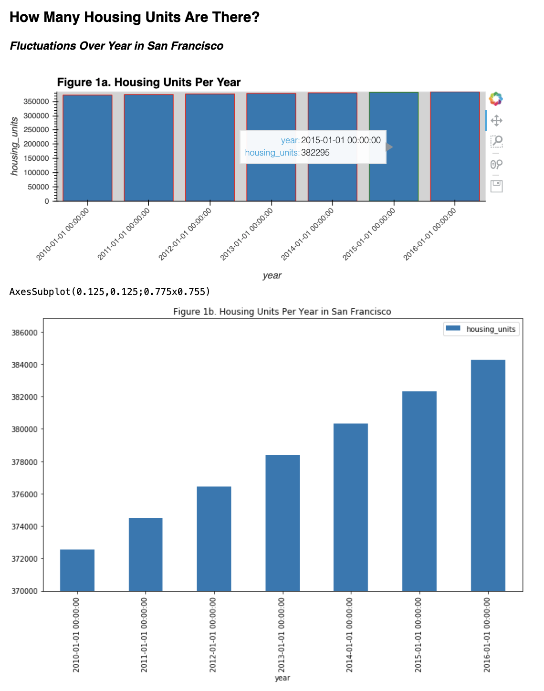

# PyViz-homework
Homework on PyViz due on 2/5/2020

# Panel Design

## Look for sunshine and ocean breeze? Warm San Francisco neighborhoods welcome you to join! 
*###Shall we buy low and sell high? Are you ready to invest for your own space or earn more money by leasing?*

While a variety of factors play roles in decision making, our analysis leads to the conclusion that real estate investors are likely to profit from purchases in Petrero Hill, Cow Hollow, Presidio Heights and South Beach. For its low unit sales price, South Beach could be more appealing to beginners. 

An analysis on housing markets in San Francisco is carried out with focuses on:
* Gross rent
* Sales price per square foot
* Housing unit supplies 
from 2010 to 2016. 

Python is used to create a panel dashbord at the end of the project.
Visual illustrations are produced using bokeh features in functions such as hvplot and plotly express.

First of all, bar charts and line plots are generated on yearly supplies, gross rents and unit sales price of San Francisco housing. See Figures 1a to 3b for displays. They are followed by an interactive line graph on yearly sales price per square foot based on neighborhoods (Figure 4).

Averages on on unit sales prices over the six-year window are used to determine the top 10 most expensive neighborhoods in San Francisco (Figure 5). From the most to the least expensive, they are:
* Union Square District, Merced Heights, Miraloma Park, Pacific Heights, Westwood Park, Telegraph Hill, Presidio Heights, Cow Hollow, Potrero Hill and South Beach

Comprehensive analysis are carried out to compare sales prices per square foot, gross rent, housing unit supplies based on their neighborhood locations. Three interactive plots, Figure 6a, 6b and 7, are produced for the comparisons.

What is our conclusion? There is no easy answer because it is a personal decision on where to live. However, neighborhoods that are high in gross rents may be profitable investment. Figure 7 suggests gross rents grow higher as it approaches the ocean. The sales price per square foot rise simultaneously, indicated by the size of the blue dots. According to Figure 6b, looking for housing with low unit sales price and high gross rents, it is suggested that Petrero Hill, Cow Hollow, Presidio Heights and South Beach are the top four potentially profitable choices for investments. In addition, there are more housing units available for those four neighborhoods. It could lead to smoother process to purchase. On the other hand, houses may be in grande sizes in those areas. While South Beach offers the lowest sales price per square foot, the earnings slope appears to be less steep compared to the other three. That could win more popularity amoung real estate investors in their early careers. 

_###After running the "panel serve dashboard.ipynb" by executing ". run.sh" in command,_
_Figures created from hvplot are displayed in the panel_
_However, the panel does not display corresponding figures from plotly express._

_*The design is as follows*_

_*Clicking on the tabs, one is directed to visual representation for one of the four categories below:*_
* Housing Units Supply of San Francisco from 2010 to 2016
    * 
* Yearly Gross Rent vs Sales Price per Square Foot 
    * Bar Charts and Line Plots
* Sales Price per Square Foot based on Neighborhoods in San Francisco
    * Interactive unit price for neighborhoods
    * Top 10 most expensive neighborhoods represented using in a bar chart
    * 
* Analysis of the interactions between the supply, gross rent, unit sales price, based on geographical locations
    * Parallel Coordinates Plot, color coded for unit sales price
    * Parallel Categories Plots, color coded for unit sales price
    * Map Box Scatter Plot based on neighborhoods, sized to represent unit sales price, color-coded on gross rent.
    * 

_*Figures produced on San Francisco Housing Market Analysis for years 2010 to 2016 are show below:*_

# References:
* CU GitLab Repository
* https://github.com/willwillis/python-pyviz-homework/blob/master/dashboard.ipynb
* https://github.com/willwillis/python-pyviz-homework/blob/master/rental_analysis.ipynb
* https://plot.ly/python/line-charts/
* https://panel.holoviz.org/gallery/index.html
* https://plot.ly/python/plotly-express/
* https://www.youtube.com/watch?v=DAQNHzOcO5A
* https://stackoverflow.com/questions/59118664/lineplot-with-markers-in-holoviews-or-hvplot
* http://holoviews.org/user_guide/Plotting_with_Bokeh.html
* http://holoviews.org/user_guide/Customizing_Plots.html
* http://holoviews.org/user_guide/Styling_Plots.html
* http://holoviews.org/user_guide/Plotting_with_Bokeh.html
* https://guides.github.com/features/mastering-markdown/